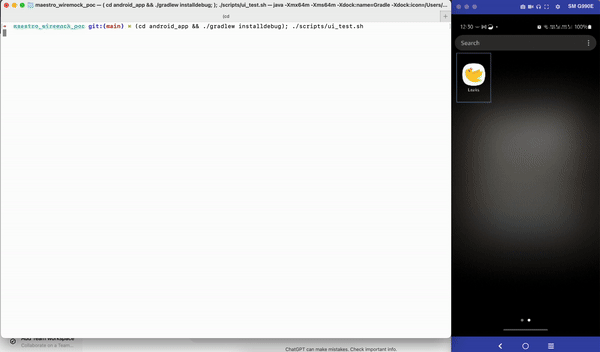

# Sample App Using WireMock API Server With Maestro Tests

This repository contains a sample app that uses WireMock as a mock API server and runs UI tests with Maestro.


**Maestro Test Run With WireMock On Android Physical Device**

## Prerequisites

- Ensure that [Maestro](https://maestro.mobile.dev/getting-started) is installed on your machine.

## Setup

1. **Update Local IP Address:**

   Before running the tests, make sure to update the local IP address in the `scripts/ui_test.sh` file:

   ```bash
   # Update this line in scripts/ui_test.sh with your local machine's IP address
   LOCAL_IP_ADDRESS=<YOUR_IP_ADDRESS>"
   ```

## Run Tests

### Android

- connect physical android device or emulator
- `cd android_app && ./gradlew installdebug && cd ..`
- `./scripts/ui_test.sh`

## Note

For Android devices to communicate with an HTTP server (like the one running on WireMock), the app must allow cleartext traffic in its network_security_config.  
Use the following configuration

```xml
<!-- cleartextTrafficPermitted is required to communicate over http -->
<!-- note the lack of system certs-->
<network-security-config>
    <base-config cleartextTrafficPermitted="true">
        <trust-anchors>
            <certificates src="user" />
        </trust-anchors>
    </base-config>
</network-security-config>
```
